# AI-Based Symptom Checker and Wellness Recommender for PCOS


An **AI-driven system for early detection and holistic management of Polycystic Ovary Syndrome (PCOS)**.
The project integrates **machine learning-based prediction**, a **cloud-deployed REST API**, and an **Android mobile application** to deliver real-time diagnosis support and personalized lifestyle recommendations.

 Supported by an extensive literature survey and a **peer-reviewed publication in a UGC Care Group-II journal**.

---

##  Key Features

* ML-based PCOS prediction using clinical and lifestyle parameters
* Cloud-hosted REST API for real-time inference
* Android application for user-friendly interaction
* Personalized lifestyle recommendations (diet, exercise, habits)
* Scalable and modular architecture

---

##  Application Screenshots

### Main Screens

| Home Screen               | User Input Screen         |
| ------------------------- | ------------------------- |
| 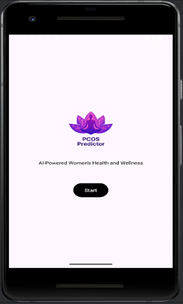 |  |

| Prediction Result         | Lifestyle Recommendation  |
| ------------------------- | ------------------------- |
| 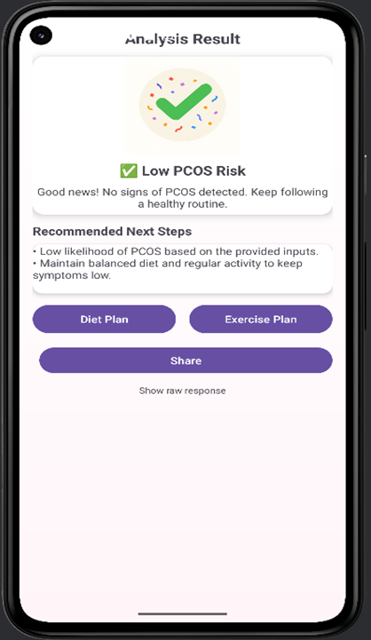 |  |

| API Connectivity          | System Output             |
| ------------------------- | ------------------------- |
|  | 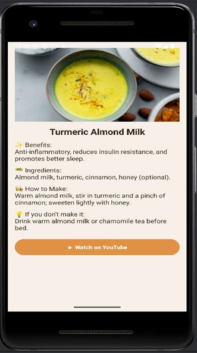 |

### Additional Screens

| Screen 10                  | Screen 11                  |
| -------------------------- | -------------------------- |
| 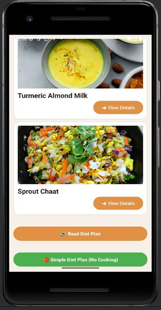 | 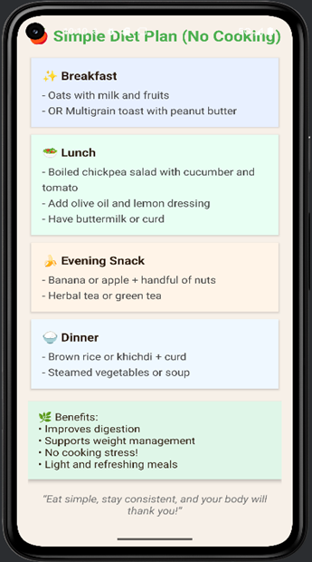 |

| Screen 12                  | Screen 13                  |
| -------------------------- | -------------------------- |
|  | 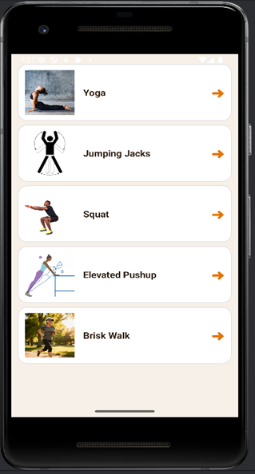 |

| Screen 14                  | Screen 15                  |
| -------------------------- | -------------------------- |
| 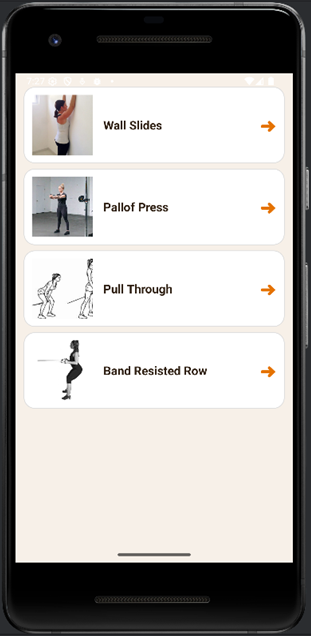 | 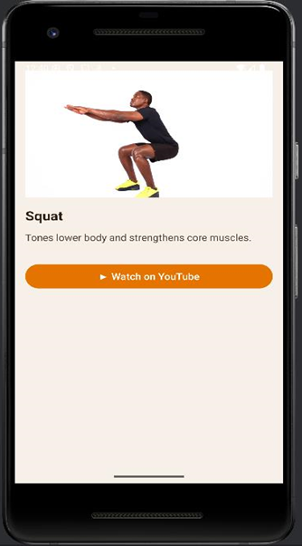 |

| Screen 16                  | Screen 17                  |
| -------------------------- | -------------------------- |
| 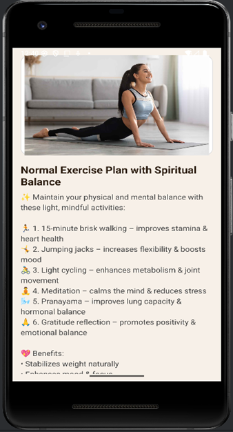 | 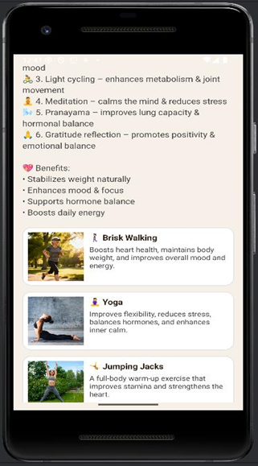 |

| Screen 18                  |
| -------------------------- |
| 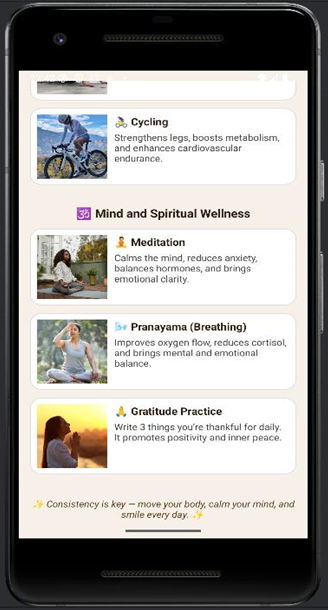 |

---

##  Project Objectives

* Collect and preprocess PCOS-related clinical data
* Identify key features influencing PCOS diagnosis
* Train and evaluate multiple ML models
* Deploy the best-performing model as a REST API
* Integrate predictions with an Android application
* Provide actionable lifestyle guidance

---

##  Literature Survey Summary

* Reviewed **30+ AI-based research papers** on PCOS
* Algorithms studied:

  * Random Forest (RF)
  * Support Vector Machine (SVM)
  * XGBoost
  * CNN-based ultrasound models
* Datasets:

  * Clinical and hormonal data
  * Electronic Health Records (EHR)
  * Imaging and gene expression data
* Reported accuracy range: **85% – 99.31%**

### Identified Research Gaps

* Lack of integrated diagnosis + lifestyle systems
* Limited real-world deployment
* Low interpretability in existing models

---

##  Proposed System

1. User enters health parameters in the Android app
2. Data is sent to a cloud-hosted Flask API
3. ML model processes the input
4. Prediction result is generated
5. Result and recommendations are returned to the app

---

##  Live Prediction API

**Endpoint:**

```
https://pcosapi-eq6x.onrender.com/predict
```

### Android API Integration (Sample)

```java
URL url = new URL("https://pcosapi-eq6x.onrender.com/predict");
```

* Secure HTTPS communication
* JSON-based request and response
* API tested using Postman

---

##  Technology Stack

* **Programming Language:** Python
* **Machine Learning:** Scikit-Learn
* **Backend Framework:** Flask
* **API Testing:** Postman
* **Mobile Application:** Android
* **Deployment Platform:** Render Cloud

---

##  Installation & Execution

```bash
git clone https://github.com/Radhika5156/pcosapi.git
cd pcosapi
python -m venv venv
pip install -r requirements.txt
python app.py
```

---

##  Results

* Multiple ML models trained and evaluated
* Best-performing model deployed as REST API
* End-to-end system tested with Android app
* Reliable and real-time prediction achieved

---

##  Project Development Timeline

* Literature review and problem identification
* Data preprocessing and feature engineering
* Model training and evaluation
* API development and deployment
* Android app integration
* Testing and documentation

---

##  Research Publication

**Title:** A Comprehensive Review of AI-Based Approaches for PCOS Diagnosis
**Journal:** Degres Journal (UGC Care Group-II)
**ISSN:** 0376-8163
**Volume & Issue:** Vol. 10, Issue 10 (2025)

**Authors:**
Radhika Vyas, Apeksha Patil, Rushikesh Patil, Mayank Sohani

🔗 [https://degres.eu/volume-10-issue-10-2025/](https://degres.eu/volume-10-issue-10-2025/)

---

##  Author

* **Radhika Vyas**
B.Tech  Computer Engineering
SVKM’s NMIMS MPSTME, Shirpur
Academic Year: 2025–26

---

##  Future Enhancements

* CNN-based ultrasound image diagnosis
* Explainable AI (SHAP / LIME)
* Wearable device integration
* Secure data storage and privacy mechanisms
* Doctor and community support modules


---
##  Download Android Application
You can download and install the Android APK from the link below:

🔗 [Download APK](https://github.com/YOUR-REPO-LINK/app-debug.apk)

